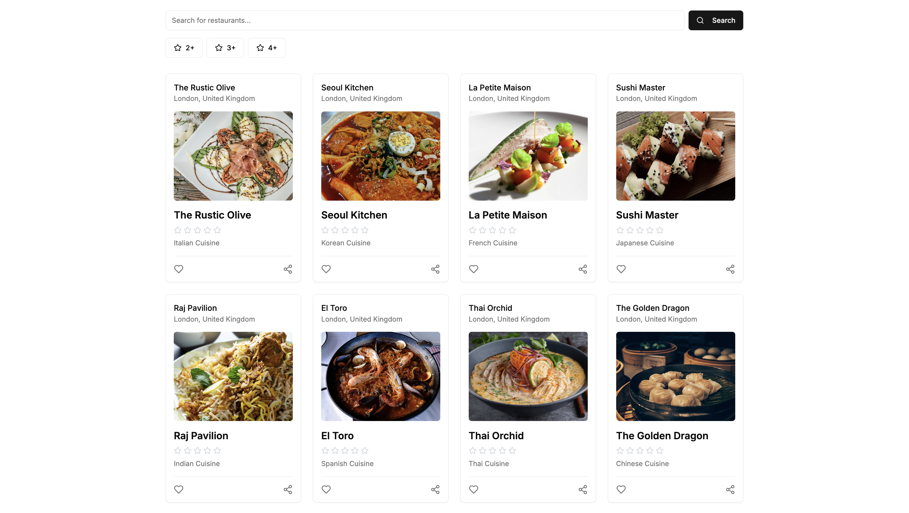
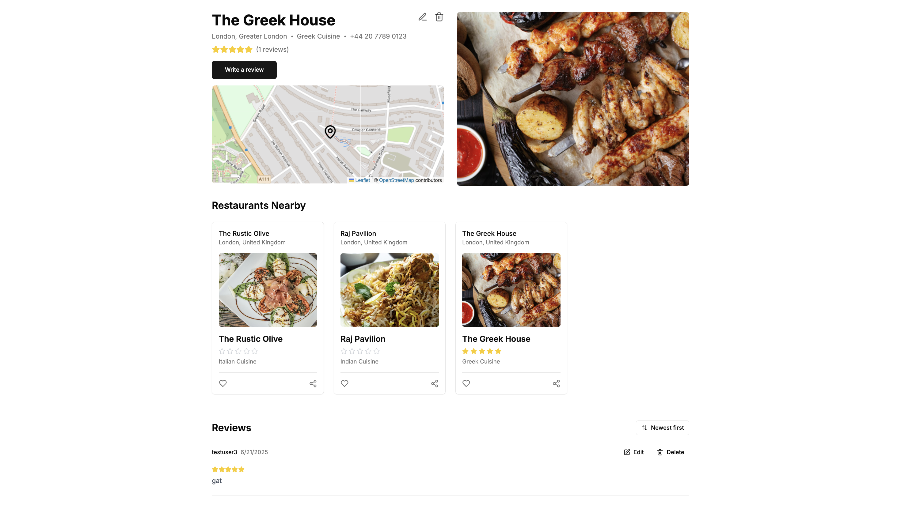
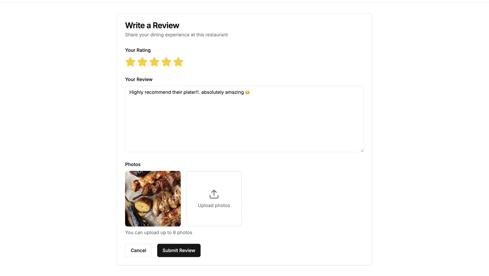

# Restaurant Review Platform: Full-Stack Discovery and Review Application


The Restaurant Review Platform is a full-stack web application designed for discovering, rating, and reviewing restaurants. It features a powerful search engine, secure authentication, and a modern, responsive user interface, allowing users to share their dining experiences with the community.

## Table of Contents
- [Demo](#demo)
- [Features](#features)
- [Technology Stack](#technology-stack)
- [Project Structure](#project-structure)
- [Setup and Installation](#setup-and-installation)
- [API Endpoints](#api-endpoints)
- [Contributing](#contributing)
- [License](#license)

## Demo

Here is a preview of the Restaurant Review Platform in action.

**Restaurant Search & Discovery:** The main dashboard for browsing and searching restaurants.
**

**Detailed Restaurant View:** A comprehensive view of a restaurant, including its details, photos, and user reviews.
**

**Review Submission Form:** The interface for users to write and submit their reviews.
**

## Features

- **Restaurant Management:**
  - **CRUD Operations:** Secure endpoints for creating, reading, updating, and deleting restaurants.
  - **Dynamic Image Uploads:** Seamlessly upload and associate photos with restaurants and reviews.

- **Advanced Search & Discovery:**
  - **Full-Text Search:** Find restaurants by name or cuisine type with fuzzy matching.
  - **Geolocation Search:** Discover nearby restaurants based on your location (latitude, longitude) and a specified radius.
  - **Filtered Results:** Narrow down searches by a minimum user rating.

- **User Reviews & Ratings:**
  - **CRUD Operations:** Authenticated users can post, update, and delete their own reviews.
  - **Edit Window:** Users have a 48-hour window to edit their reviews after posting.
  - **Average Rating:** Restaurant ratings are automatically calculated and updated based on user reviews.

- **Secure Authentication:**
  - **OAuth 2.0 / OIDC:** User authentication is handled by Keycloak, ensuring a secure and standardized login flow.
  - **Role-Protected Endpoints:** Backend API is secured using Spring Security, with distinct permissions for public (GET) and authenticated actions.

## Technology Stack

The project is architected with a separate backend service and a frontend application.

### Backend (Spring Boot)
- **Framework:** Spring Boot 3.5.0
- **Language:** Java 21
- **Data Persistence:** Spring Data Elasticsearch
- **Database:** Elasticsearch
- **Authentication:** Spring Security with OAuth2 / JWT (Keycloak)
- **API:** RESTful API with Spring Web
- **File Storage:** Local FileSystem Storage
- **Build Tool:** Maven

### Frontend (Next.js)
- **Framework:** Next.js 14 (with React 18)
- **Language:** TypeScript
- **UI:** Shadcn/UI, Radix UI & Tailwind CSS
- **Authentication:** `react-oidc-context` for OpenID Connect integration
- **HTTP Client:** Axios
- **Code Quality:** ESLint & Prettier

## Project Structure

The repository is organized into two main directories: `rr-be` for the backend and `rr-fe` for the frontend.

```
.
├── rr-be/                      # Spring Boot Backend
│   ├── pom.xml
│   └── src/
│       └── main/
│           ├── java/com/prp/rr_be/
│           │   ├── config/         # Spring Security Configuration
│           │   ├── controllers/    # API Controllers
│           │   ├── domain/         # DTOs, Entities
│           │   ├── mappers/        # MapStruct Mappers
│           │   ├── repositories/   # Elasticsearch Repositories
│           │   └── services/       # Business Logic (Restaurant, Review, Photo)
│           └── resources/
│               └── application.properties
│
└── rr-fe/                      # Next.js Frontend
    ├── package.json
    ├── next.config.mjs         # Next.js configuration
    ├── .env.local              # Environment variables (Keycloak, API URL)
    └── src/
        ├── app/                # App Router, pages, and layouts
        ├── components/         # Reusable React components (UI)
        ├── lib/                # Utilities, hooks, context providers
        └── types/              # TypeScript type definitions
```

## Setup and Installation

Follow these steps to get the application running on your local machine.

### Prerequisites
- Java JDK 21
- Apache Maven
- Node.js (v18 or later) & npm
- A running Elasticsearch instance
- A running Keycloak instance

### 1. Backend Setup (`rr-be`)

1.  **Configure Backend:**
    - Navigate to `rr-be/src/main/resources/application.properties`.
    - Ensure the Elasticsearch and Keycloak URLs are correctly configured.

    ```properties
    # Elasticsearch Configuration
    spring.elasticsearch.uris=http://localhost:9200

    # Keycloak Configuration
    spring.security.oauth2.resourceserver.jwt.issuer-uri=http://localhost:9090/realms/your-realm
    ```

2.  **Run the Backend:**
    - Open a terminal in the `rr-be` directory.
    - Run the application using Maven:
      ```bash
      mvn spring-boot:run
      ```
    - The backend server will start on `http://localhost:8080`.

### 2. Frontend Setup (`rr-fe`)

1.  **Configure Frontend:**
    - In the `rr-fe` directory, create a file named `.env.local`.
    - Add the following environment variables, replacing the values with your Keycloak and API details.

    ```env
    NEXT_PUBLIC_KEYCLOAK_URL=http://localhost:9090
    NEXT_PUBLIC_KEYCLOAK_REALM=restaurant-review
    NEXT_PUBLIC_KEYCLOAK_CLIENT_ID=restaurant-review-app
    NEXT_PUBLIC_API_URL=http://localhost:8080/api
    ```

2.  **Install Dependencies and Run:**
    - Open a separate terminal in the `rr-fe` directory.
    - Install the required npm packages:
      ```bash
      npm install
      ```
    - Start the development server:
      ```bash
      npm run dev
      ```
    - The frontend application will be available at `http://localhost:3000`.

## API Endpoints

The backend exposes the following RESTful API endpoints.

### Restaurant Endpoints (`/api/restaurants`)
| Method | Path | Description |
| :--- | :--- | :--- |
| `GET` | `/` | Search restaurants with optional filters (query, rating, location). |
| `POST` | `/` | Create a new restaurant (Authenticated). |
| `GET` | `/{id}` | Get a single restaurant by ID. |
| `PUT` | `/{id}` | Update an existing restaurant (Authenticated). |
| `DELETE`| `/{id}` | Delete a restaurant (Authenticated). |

### Review Endpoints (`/api/restaurants/{restaurantId}/reviews`)
| Method | Path | Description |
| :--- | :--- | :--- |
| `GET` | `/` | Get all reviews for a specific restaurant. |
| `POST` | `/` | Create a new review for a restaurant (Authenticated). |
| `GET` | `/{reviewId}` | Get a single review by ID. |
| `PUT` | `/{reviewId}` | Update an existing review (Authenticated, by author). |
| `DELETE`| `/{reviewId}` | Delete a review (Authenticated, by author). |

### Photo Endpoints (`/api/photos`)
| Method | Path | Description |
| :--- | :--- | :--- |
| `POST` | `/` | Upload a new photo file (Authenticated). |
| `GET` | `/{id}` | Get a photo by its filename. |


## Contributing

Contributions are what make the open-source community such an amazing place to learn, inspire, and create. Any contributions you make are **greatly appreciated**.

1.  Fork the Project
2.  Create your Feature Branch (`git checkout -b feature/AmazingFeature`)
3.  Commit your Changes (`git commit -m 'Add some AmazingFeature'`)
4.  Push to the Branch (`git push origin feature/AmazingFeature`)
5.  Open a Pull Request

## License

This work is licensed under the Creative Commons Attribution-NonCommercial-ShareAlike 4.0 International License.

You are free to:
- **Share** — copy and redistribute the material in any medium or format
- **Adapt** — remix, transform, and build upon the material

Under the following terms:
- **Attribution** — You must give appropriate credit to Devtiro, provide a link to the license, and indicate if changes were made. You may do so in any reasonable manner, but not in any way that suggests the licensor endorses you or your use.
- **NonCommercial** — You may not use the material for commercial purposes.
- **ShareAlike** — If you remix, transform, or build upon the material, you must distribute your contributions under the same license as the original.

To view a copy of this license, visit [https://creativecommons.org/licenses/by-nc-sa/4.0/](https://creativecommons.org/licenses/by-nc-sa/4.0/)

For attribution, please include the following:
*"Build a Blog Platform App by Devtiro is licensed under CC BY-NC-SA 4.0. Original content available at https://www.youtube.com/@devtiro and https://www.devtiro.com."*